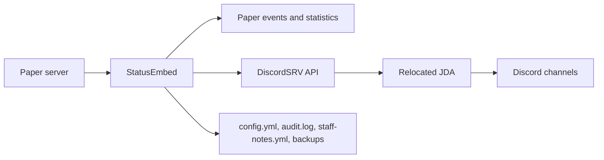

# DiscordSRVStatusEmbed

[](pom.xml)
[](#compatibility)
[](#requirements)
[](#license)

DiscordSRVStatusEmbed is a Paper plugin that extends DiscordSRV with server-status embeds, Discord commands, player statistics, suggestions, reports, verification, announcements, diagnostics, and configurable operational automation.

> **Current release:** 1.11.0. The project is migrating from the original `StatusEmbed` facade to focused services and a configurable automation engine.

## Why this plugin exists

DiscordSRV already bridges Minecraft chat and Discord. This plugin adds server-specific workflows that are not part of that bridge: polished server information embeds, configurable community commands, a Geyser-friendly report menu, staff tools, a status dashboard, and controlled Discord interactions.

## Key features

| Area | Implemented behavior |
| --- | --- |
| Status | Start/stop embeds, live status dashboard, uptime, memory, CPU estimate, Discord connectivity, health indicator |
| Server information | Java and Bedrock addresses, version, MOTD, online players, ping |
| Player information | Profile, playtime, last seen, statistics, configurable leaderboards, avatar links |
| Community | Suggestions with staff action buttons, configurable FAQ and staff roster |
| Moderation | Geyser-compatible `/dsreport`, configurable categories, Discord report embeds, staff notifications, audit log |
| Operations | In-game settings menu, config reload, backup/restore, automatic backups, diagnostics |
| Discord automation | Announcement relay, incident logging, verification-role panel, sequential changelog publisher |
| Donations | Configurable GCash embed and QR attachment |

## Compatibility

The target server is Paper `26.2`, currently an experimental build. Compatibility with that runtime should be treated as experimental until the plugin has been tested against the exact server build used in production.

The project currently compiles against Paper API `1.21.8-R0.1-SNAPSHOT`, declares Bukkit API `1.21`, and requires Java 25. This is the current compatibility baseline because this repository does not declare a stable Paper API artifact for `26.2`. Do not assume that every experimental `26.2` change is covered by the compile-time API; test on a backup server and keep rollback copies of the plugin and configuration. Spigot compatibility is not verified.

Discord features use the relocated JDA classes supplied by DiscordSRV 1.30.5. The plugin depends on DiscordSRV and must not be run without it.

## Requirements

- Paper 26.2 experimental with Java 25 (runtime target; verify the exact build before production use).
- The current build API baseline is Paper `1.21.8-R0.1-SNAPSHOT`.
- DiscordSRV 1.30.5 or a compatible build exposing the APIs used here.
- A Discord bot configured through DiscordSRV.
- Discord bot permissions appropriate to enabled features: View Channel, Send Messages, Embed Links, Attach Files, Add Reactions, Manage Roles, and message-history access.
- Manage Roles with the bot's highest role above the Minecraft verification role.

## Installation

1. Stop the server.
2. Install and configure DiscordSRV.
3. Copy `DiscordSRVStatusEmbed-1.11.0.jar` into `plugins/`.
4. Start the server once so the plugin creates its data folder and configuration.
5. Edit `plugins/DiscordSRVStatusEmbed/config.yml`; replace placeholder channel IDs and staff IDs.
6. Restart the server. A full restart is recommended after replacing the JAR because DiscordSRV registers slash commands during connection.

The bundled `gcash-qr.jpg` is copied to the plugin data folder on first startup. Existing configuration files are not overwritten by `saveDefaultConfig()`.

## Quick start

At minimum, configure:

```yaml
server-info:
  java-ip: "de1-free.witchly.host"
  java-port: 40199
  bedrock-ip: "de1-free.witchly.host"
  bedrock-port: 40199

reports:
  channel-id: "YOUR_REPORTS_CHANNEL_ID"

verification:
  channel-id: "1527525002868555827"
  role-id: "1526031674729693285"

changelog:
  channel-id: "1527193381825151169"
```

Then verify startup logs. The plugin reports whether `/dsreport`, `/dsnote`, `/dswatch`, `/discordstatusdiagnostics`, `/discordstatusconfig`, `/discordstatusbackup`, `/discordstatusrestore`, and `/discordstatusreload` were registered.

## Configuration reference

All paths below refer to the generated `config.yml`.

| Path | Default | Purpose |
| --- | --- | --- |
| `channel-id` | configured ID | Channel for server start/stop status embeds. |
| `embeds.*-color` | hex colors | Theme colors for info, donations, stats, announcements, and reports. |
| `server-start.*` | enabled | Startup embed title, description, author, footer, color, and timestamp. |
| `server-stop.*` | enabled | Shutdown embed settings. Shutdown delivery is blocking with a five-second wait. |
| `server-info.enabled` | `true` | Enables server-info prefix/slash command handling. |
| `server-info.prefix` | `!` | Persistent prefix for legacy Discord text commands; maximum five non-space characters. |
| `discord.owner-ids` | `[]` | Discord user IDs allowed to use purge and change the prefix. |
| `server-info.java-ip/java-port` | server address | Java endpoint displayed by IP commands. |
| `server-info.bedrock-enabled` | `true` | Controls Bedrock availability output. |
| `server-info.bedrock-ip/bedrock-port` | server address | Bedrock endpoint displayed by Bedrock commands. |
| `server-info.version` | configured version | Version displayed by `/version`; empty would fall back to Bukkit's version. |
| `commands.report.enabled` | `true` | Enables the in-game `/dsreport` workflow. |
| `security.command-cooldown-seconds` | `3` | Per-user cooldown for legacy Discord prefix commands. |
| `moderation.staff-user-ids` | `[]` | Discord user IDs allowed to operate report/suggestion buttons. |
| `verification.*` | configured IDs | Verification channel, Minecraft role, panel toggle, and saved panel message ID. |
| `changelog.*` | configured channel | Persistent changelog channel, message ID, entries, and published versions. |
| `audit-log.enabled` | `true` | Writes administrative/report/button events to `audit.log`. |
| `watchlist.players` | `[]` | Minecraft names staff should be alerted about when joining. |
| `incident-log.*` | disabled | Optional join/leave/watchlist event channel. |
| `status-dashboard.*` | enabled | Channel, interval, and bot-owned message ID for the status dashboard. |
| `backups.auto.*` | enabled | Automatic config backup interval and retention count. |
| `donations.*` | configured | GCash number, account name, and QR filename. |
| `suggestions.channel-id` | configured | Destination for submitted suggestions. |
| `avatars.provider-url` | `mc-heads.net` | Name-based avatar URL template; `{player}` is replaced with the Minecraft name. |
| `faq.*` | configured | Key/value fields rendered by FAQ. |
| `staff.*` | configured | Role names and member lists rendered by Staff. |
| `leaderboards.default-type/limit` | `PLAYTIME`/`10` | Default leaderboard and maximum entries. |
| `announcements.*` | configured | Source and target channel IDs for announcement relay. |
| `reports.*` | configured | Report channel, categories, details prompt, and Discord instructions. |
| `log-purge.*` | configured | Optional periodic deletion of a configured channel's recent messages. |
| `automations.*` | disabled sample | Validated trigger/action workflows executed by the automation engine. Invalid definitions are logged and skipped. |
| `automation-channels.*` | empty | Friendly names mapped to numeric Discord channel IDs for automation actions. |

### Valid leaderboard types

`PLAYTIME`, `KILLS`, `DEATHS`, `MOB_KILLS`, and `BLOCKS_MINED`. The legacy command also accepts `mobs` and `mined` aliases.

### Channel ID validation

Channel IDs must be numeric Discord snowflakes, normally 17–20 digits. Placeholder strings such as `YOUR_REPORTS_CHANNEL_ID` are rejected by the relevant feature and produce a diagnostic/log warning.

## Commands

### Discord slash commands

| Command | Behavior |
| --- | --- |
| `/help` | Command guide. |
| `/java`, `/ip`, `/server` | Java endpoint embed. |
| `/bedrock`, `/bedrockip` | Bedrock endpoint embed. |
| `/version` | Minecraft version embed. |
| `/playerlist`, `/players` | Online players with ping and avatar links. |
| `/status` | Current online status and player count. |
| `/motd` | Server MOTD. |
| `/ping` | Discord gateway latency. |
| `/purge <amount>` | Owner-only deletion of 1–100 recent messages. |
| `/prefix [value]` | Show the current prefix or owner-only change it. |
| `/suggest` | Suggestion instructions. Submission with text is implemented through `!suggest <idea>`. |
| `/gcash` | GCash embed with QR attachment. |
| `/faq` | Configured FAQ fields. |
| `/staff` | Configured staff roster. |
| `/report` | Discord reporting instructions; it does not collect the in-game report. |
| `/leaderboard` | Configured leaderboard. |
| `/profile` | Explains the current `!profile <player>` usage. |

### Discord prefix commands

The same server-info commands are available with `!`. Additional commands are:

| Command | Behavior |
| --- | --- |
| `!suggest <idea>` | Posts a suggestion and adds ⭐/❌ reactions plus moderation buttons. |
| `!playtime <player>` | Playtime totals. |
| `!seen <player>` | Login, logout, and relative last-seen information. |
| `!stats <player>` | Native Paper/Bukkit statistics. |
| `!profile <player>` | Unified player profile. |
| `!leaderboard [type]` | Selectable leaderboard category. |
| `!gcash` | Donation embed with QR attachment. |
| `!purge <amount>` | Owner-only deletion of 1–100 messages, including individual deletion for messages older than 14 days. |
| `!prefix [value]` | Show or owner-only change the persistent prefix, up to five characters. |

### In-game commands

| Command | Permission | Behavior |
| --- | --- | --- |
| `/dsreport [player]` | none | Geyser-compatible player/reason report menu; optional direct target. |
| `/dsnote <add\|list\|clear> <player> [note]` | `discordstatus.notes` | Persistent staff notes in `staff-notes.yml`. |
| `/dswatch <add\|remove\|list> [player]` | `discordstatus.watchlist` | Persistent config-backed watchlist. |
| `/discordstatusconfig` (`/dscfg`) | `discordstatus.config` | Toggle selected plugin features. |
| `/discordstatusbackup` (`/dsbackup`) | `discordstatus.config` | Copy the active config into `backups/`. |
| `/discordstatusrestore <file>` (`/dsrestore`) | `discordstatus.config` | Restore a generated timestamped backup. |
| `/discordstatusdiagnostics` (`/dsdiag`) | `discordstatus.config` | Report Discord/channel/dashboard configuration state. |
| `/discordstatusreload` | `discordstatus.reload` | Reload configuration and attempt pending changelog publishing. |

## Permissions

| Permission | Default | Purpose |
| --- | --- | --- |
| `discordstatus.reload` | OP | Reload configuration. |
| `discordstatus.config` | OP | Settings menu, diagnostics, backup, and restore. |
| `discordstatus.notes` | OP | Staff note management. |
| `discordstatus.watchlist` | OP | Watchlist management. |
| `discordstatus.reports.notify` | OP | In-game report notifications. |

Discord button authorization is separate from Bukkit permissions and uses `moderation.staff-user-ids`.

## Placeholder support

The plugin does not implement a PlaceholderAPI expansion and does not declare PlaceholderAPI as a dependency. It supports only its own configuration substitutions, including `%botavatarurl%`, and the `{player}` token in `avatars.provider-url`.

## How it works



`StatusEmbed` remains the Bukkit plugin entry point and DiscordSRV `SlashCommandProvider`. The modular automation layer is registered as a separate Bukkit listener. It validates YAML definitions at startup, dispatches supported Paper events, schedules interval triggers on Bukkit's scheduler, executes Minecraft actions on the server thread, and uses JDA's asynchronous `queue()` operations for Discord actions. Existing legacy handlers remain active while responsibility is extracted incrementally.

The current source imports DiscordSRV and relocated JDA classes directly. It does not use reflection for DiscordSRV integration.

## Example embeds

The status dashboard is rendered as a single editable embed containing server status, player count, uptime, memory, CPU/RAM bars, Discord connectivity, health, and Discord's localized last-updated timestamp. Report and suggestion embeds can include action buttons when moderator IDs are configured.

## Screenshots

No screenshots are currently stored in the repository. Add screenshots under `docs/images/` when a stable server configuration is available.

## Project structure

```text
.
├── pom.xml
├── dependency-reduced-pom.xml
├── DiscordSRV-Build-1.30.5.jar
├── src/main/java/me/example/statusembed/StatusEmbed.java
├── src/main/resources/config.yml
├── src/main/resources/plugin.yml
├── src/main/resources/gcash-qr.jpg
└── target/                         # generated build output; should not be committed
```

## Building from source

```text
mvn clean package
```

The POM targets Java 25, uses Paper API as `provided`, and uses the local DiscordSRV JAR as a system-scoped dependency. The shade plugin is configured, but Paper and DiscordSRV remain runtime-provided dependencies; the resulting plugin must still be installed alongside DiscordSRV.

GitHub Actions runs Maven verification automatically for pushes and pull requests. To publish a release, create and push a semantic-version tag such as `v1.9.1`:

```text
git tag v1.9.1
git push origin v1.9.1
```

The release workflow builds the plugin, generates GitHub release notes from commits and pull requests, and attaches the plugin JAR plus project documentation. Successful builds also retain a downloadable artifact for troubleshooting.

> **Note:** GitHub Actions requires the Java 25 toolchain and the checked-in `DiscordSRV-Build-1.30.5.jar`. DiscordSRV remains a runtime dependency and is not shaded into the plugin.

## Development notes

- Bukkit/Paper state is read on the server thread through scheduled tasks when invoked from Discord callbacks.
- Discord network actions generally use JDA's asynchronous `queue()` API.
- Shutdown status delivery is intentionally blocking for up to five seconds because the JVM may exit immediately.
- Configuration reload does not overwrite existing user configuration, so new settings must be merged manually after upgrades.
- The legacy `StatusEmbed` facade still owns many existing handlers; modular extraction is intentionally staged to preserve behavior.
- Automation Discord role assignment/removal requires a project-specific guild/role adapter before those actions are enabled.

## Troubleshooting

| Symptom | Check |
| --- | --- |
| Commands are missing | Confirm the 1.9.0 JAR is installed once, fully restart, and check registration logs. |
| Dashboard update says the bot cannot edit a message | Clear `status-dashboard.message-id`; the plugin will create a bot-owned message. |
| Verification does not assign the role | Give the bot Manage Roles and move its role above the Minecraft role. |
| Changelog does not send | Check `changelog.channel-id`, bot permissions, and `published-versions`. |
| Reports do not arrive | Validate `reports.channel-id` and ensure the bot can send embeds there. |
| Offline players show Steve | Configure a name-based `avatars.provider-url`; DiscordSRV's own AvatarUrl setting is separate. |
| New config keys are missing | Merge them into the existing generated `config.yml`; Bukkit does not overwrite it automatically. |
| Build fails with missing Java | Install Java 25 and use the Maven command from a Java 25 environment. |

## FAQ

**Does this replace DiscordSRV?** No. DiscordSRV is required and remains responsible for the bridge and JDA connection.

**Does `/report` work in Minecraft?** No. This plugin deliberately uses `/dsreport` to avoid collisions with Minecraft or other plugins. `/report` is the Discord instruction command.

**Does the plugin create real Discord threads for suggestions?** Version 1.8.0 attempts to call the installed JDA message-thread API after posting each suggestion. If the installed DiscordSRV build does not expose that API, it logs a clear warning and keeps the suggestion message usable without a thread.

**How does the changelog avoid spam?** The bot stores `changelog.message-id`, edits that bot-owned message when new entries are available, and recreates it if it is deleted or invalid.

**Does it use a database?** No. Configuration, audit logs, staff notes, and backup files are file-based.

**Does it support Vault or PlaceholderAPI?** No. Economy and PlaceholderAPI integrations are not implemented.

## Known limitations

- `StatusEmbed.java` is a large god class with multiple responsibilities.
- No automated unit, integration, or Paper server tests are included.
- Slash commands requiring a player argument are not modeled with Discord option validation/autocomplete; the richer player forms currently use legacy text arguments.
- The status dashboard's CPU value is a JVM process estimate; its network line represents Discord connectivity, not bandwidth.
- Changelog entries are configuration-driven; the plugin does not derive release notes from Git history.
- The bundled JDA surface lacks the thread APIs needed for real suggestion threads.
- No SQLite/MySQL persistence, PlaceholderAPI expansion, webhook mode, poll/giveaway system, or Discord ticket/thread system is present.
- The repository contains generated JARs and build output under `target/`; there is no `.gitignore` in the audited tree.

## Roadmap

See [PROJECT_REVIEW.md](PROJECT_REVIEW.md) and [IMPROVEMENTS.md](IMPROVEMENTS.md). The first priorities are splitting the monolithic class, adding tests, improving slash-command options, replacing the system-scoped DiscordSRV dependency strategy, and adding supported thread/persistence abstractions.

## Contributing

1. Create a focused branch.
2. Keep Paper API calls on the server thread and Discord calls asynchronous.
3. Update `config.yml`, `plugin.yml`, and README documentation for behavior changes.
4. Run `mvn clean package` with Java 25.
5. Test on a disposable Paper server with DiscordSRV before opening a pull request.

## License

No license file or license declaration is currently present. Treat the project as **all rights reserved** until a license is added by the project owner.

## Credits

- Paper API for the Minecraft server integration.
- DiscordSRV for the Discord bridge and relocated JDA runtime.
- mc-heads.net as the default configurable player-avatar provider.
